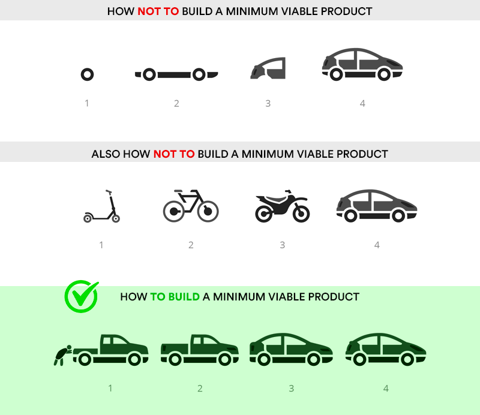

# Final Project Guidelines

## Interjection by Sean

✨ **GO BUILD SOMETHING RAD!** 🌈

In my (Sean's) opinion, apps should either be:

* Something that sounds fun

OR

* Something that solves a problem.

The proverbial "sweet spot" is an app that does _both_ of those things.

So, start there, and see where you go!

## We now return you to the regularly scheduled README, already in progress

The purpose of the final project is to showcase your abilities as a developer, not to create the Next Big Thing (but if you can do both, go for it!). Make sure to decide beforehand what you think your greatest strengths are, and use your application and presentation as a platform to showcase those strengths. Together, your final project and portfolio should tell a story about what sets you apart from other developers, so that you can stand out when seeking employment.

For example, if you have a graphic design background, you should nail the graphic design, in addition to the technical aspects, so that you can tell the story of your diverse experience. If you have business acumen, you could develop an idea that shows your ability to create a viable business idea and execute a minimum viable product quickly. This doesn't have to be anything spectacular, just choose some strength about yourself that you can showcase with the application idea or the technical choices you make. Ask your instructor and classmates for help refining which strengths you should focus on.

## Requirements

### Project Management

1. Make regular commits each day _(at least one commit per person per day)_
    * **Failure to commit will forfeit graduation**
2. Before starting development, you must create wireframes
    * These can be hand sketches or digital designs in Figma, Illustrator, etc.
3. You must document at least 8 User Stories about your app
    * "As an admin user, I want the ability to create courses so that learners can see what courses are available."
    * User stories follow this structure: "As a **\_\_\_\_** I want **\_\_\_** so that **\_\_\_\_**"
4. You must write a README that lists all the technologies and APIs used in the project.
    * Your README is usually the first thing employers see about your project/portfolio. _Don't blow this off!_ It's a big opportunity to show how professionally you can communicate in a technical setting.
5. Be prepared to explain your project with an [elevator pitch](https://www.universitylabpartners.org/blog/how-to-write-a-winning-elevator-pitch):
    * 15 to 25 words of what your app does

### Backend

1. Build a project with both user authentication and authorization
2. Use data stored in a persistent database _(an RDBMS like Postgres or MySQL is preferred)_
3. Build a RESTful API.
    * Django REST Framework is recommended.
    * You can try others, but know that time is limited so you'll need to account for learning time!
4. Include at least one image or file upload

### Frontend

1. Build a responsive UI that works across various screen sizes.
    * React is recommended
    * You can try others (i.e. Remix, NextJS) but be sure to account for learning time in your estimates.
2. Implement CRUD functionality

### Level Up

1. Integrate at least one 3rd-party API
2. Use at least one technology or package we haven't covered in class
3. Your application must be deployed (consider [Render](https://render.com/), [Heroku](https://heroku.com), or [Fly.io](https://fly.io/))
4. The URL for the deployed site should be in your README and in your repo description
5. All code should conform to best practices ([PEP-8](https://peps.python.org/pep-0008/), [Google JavaScript Style Guide](https://google.github.io/styleguide/jsguide.html), [Airbnb React Style Guide](https://github.com/airbnb/javascript/tree/master/react)) and be DRY

### Special considerations

We have seen many web developers succeed within these requirements and we know you can too! Sometimes a great idea comes along that doesn't quite fit this mold. If you have a project idea with requirements different from what is outlined above, speak to your instructor about it as soon as possible. **Additional allowances or changed requirements must be agreed upon in writing before you proceed working on them.** Submitting a project that is unexpectedly outside these bounds will forfeit both graduation and career support.

## Pitching The Projects

Start thinking about final projects ahead of time, and meet with your instructor if you're devoid of ideas.

Make sure your projects are centered around things you truly care about; bee-keeping, beer, dancing, hiking, basketball, etc. This makes a huge difference and can make the project a lot of fun! Chat with your classmates if you need help coming up with fun ideas.

## Ask Your Peers for Feedback

Community feedback is invaluable in keeping scope-creep (a.k.a kitchen sink syndrome) out and making sure the projects are the right mix of ambition, talent, feasibility, and hubris _(a careful mixture of all four is required)_.

Peer code reviews are also extremely helpful. This is a team activity, not a competition: while you must complete your project indpendently, we encourage you to check in with your classmates frequently for feedback during the development process.

## Start Small, Grow with Agility

## 3rd Party API Testing

You will want to test any 3rd party APIs you have in mind to verify that they are suitable for your needs. Within one week of beginning final projects, you are required to demonstrate that your API is suitable by showing it being used in your app.

**NOTE:** It's not unusual for an API to go offline, break down, hit a rate limit.  If you're using a 3rd party API, it's recommended to have a backup "in case of emergency, break glass" type of file. Usually this is a JSON file with the usual output you'd expect from the API.

This is also helpful while developing, so you're not constantly hitting an API over and over.

## Final Project Q&A

1. **Where do we have to be during final projects? In the lab? Home?**
    1. Monday through Thursday, be at Carolina Code School's campus by 10 am for a short standup meeting. We will be holding small lectures about relevant topics as the class needs, and the instructional staff will be onsite to answer questions and provide guidance. **If you don't show up, ask questions, and drive your project in this crucial 3-week period, you won't receive career support.**
    2. On Fridays we will continue to have huddles at 9 AM, followed by a short standup meeting.
2. **How often will lectures happen, and will they be optional?**
    1. There is no set lecture schedule during final projects. Instructional staff (including TAs) may hold impromptu lectures to fill in gaps when multiple students are struggling with the same topic.
    2. Students will be notified in class communication channels ahead of time if a lecture is planned. No lecture during this time is mandatory, but you will be responsible for project requirements even if you miss a relevant lecture. **We strongly suggest attending any lecture opportunities during this time.**
3. How often do we check in with the instructor?
    1. You must check in with your instructor and/or campus coordinator each morning during standup.
    2. You must attend one 1:1 project check-in with your instructor weekly. These will usually be on Fridays.
    3. There will be a final "Demo Day Ready" check-in 1:1 ~2 days before Demo Day. Your project must be functioning and demoed for the instructional team at this time. **If your project is not in a demoable state at this time, you will be removed from the Demo Day lineup.**

## Resources

* Check out these [TED Talks](https://www.ted.com/playlists/226/before_public_speaking) to help you get ready to speak in front of a crowd.
