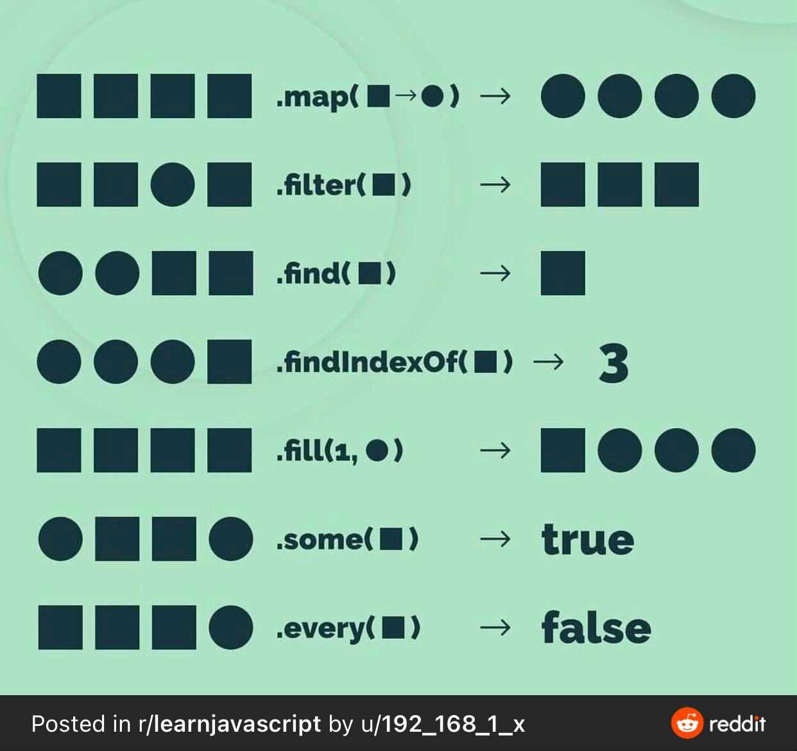
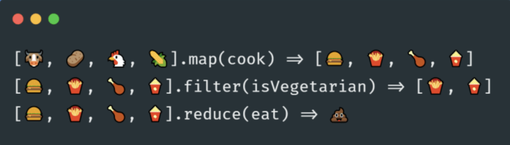
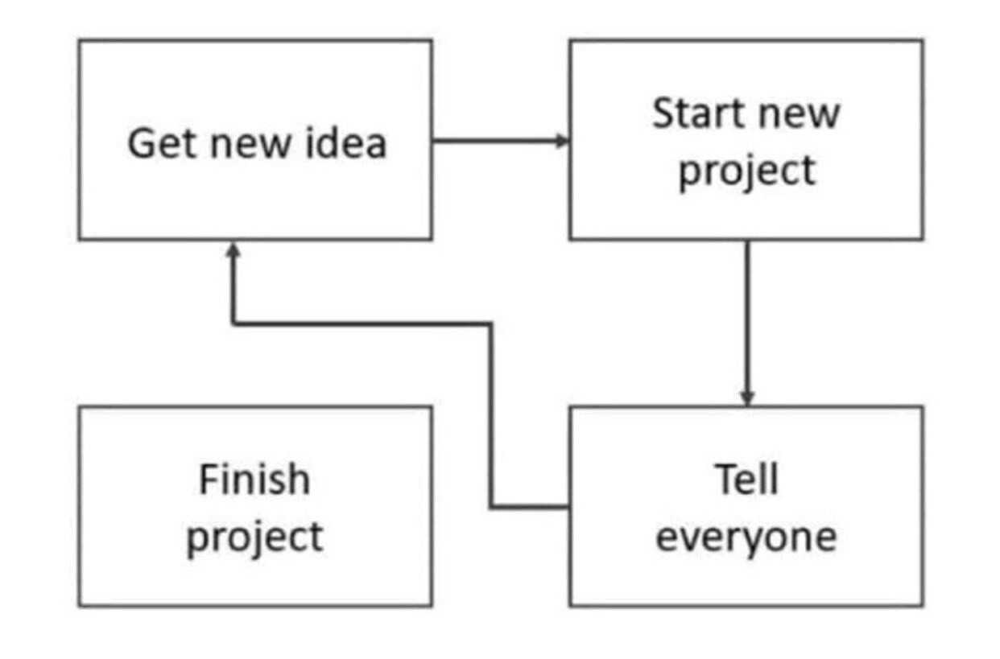

# Week 3 - Day 2

## ATTACK OF THE 13 QUESTION QUIZ

* [Our journey so far...(HTML/CSS/JS)](https://forms.gle/XbpJ2GKmNn6TkGoLA)

## Review

* [jQuery to JS Conversion: jQuery Music Box](https://github.com/seanrreid/jquery_music_box)

## Presentations

* [Scope and Callbacks](https://docs.google.com/presentation/d/1RtrA2VlRYspHjE-XtdlunvQTvrT8w0RjCFo4O1M6Jwc/edit?usp=sharing)
* [Array Methods](https://docs.google.com/presentation/d/1rDNtcpH7hSSYfIoYzCi6yCLv_SLQp2rOKT51gGa2Kxo/edit?usp=sharing)

## Helpful Links

* [MDN: The Fetch API](https://developer.mozilla.org/en-US/docs/Web/API/Fetch_API)
* [MDN: Using the Fetch API](https://developer.mozilla.org/en-US/docs/Web/API/Fetch_API/Using_Fetch)
* [MDN: Working with json](https://developer.mozilla.org/en-US/docs/Learn/JavaScript/Objects/JSON)
* [CodeAcademy: What is REST?](https://www.codecademy.com/article/what-is-rest)

> JSON is a text-based data format following JavaScript object syntax, which was popularized by Douglas Crockford. Even though it closely resembles JavaScript object literal syntax, it can be used independently from JavaScript, and many programming environments feature the ability to read (parse) and generate JSON.

* [Chuck Norris Quotes API](https://api.chucknorris.io/)

## Recommended Reading

* [5 Rules to Improve Code Readability](https://medium.com/better-programming/5-rules-to-improve-code-readability-83eda50ca780)
* [What is JavaScript Made Of?](https://overreacted.io/what-is-javascript-made-of/)
* [How JavaScript Works](https://medium.com/better-programming/how-javascript-works-1706b9b66c4d)
* [What Not to Do as a Programmer - My List After 2 Years of Working In Teams](https://dev.to/haseebelaahi/what-not-to-do-as-a-programmer-my-list-after-2-years-of-working-with-teams-1b23)

    > Do Not Fall In Love ❤️  With Your Code 
    > The number 1 mistake a lot of devs make at the start of their careers is treating their code like their babies or pets. 
    > Sure, we all love our work but always remember what your end goal is, to write good code and collectively contribute to making the product/project you are working on better every day. 
    > When you don't attach your feelings with the code you write, there is a better chance you'll always try to make it better and not let your feelings come in way of improving it.

---

## Other

* __VIDEO__: [What the heck is the event loop anyway? | Philip Roberts | JSConf EU](https://www.youtube.com/watch?v=8aGhZQkoFbQ)

## Helpful Guides

### Array Methods

Array methods, but with food! (not mine, but versions of this are all over the interwebs...)

### The Lifecycle of _EVERY_ Personal Project

