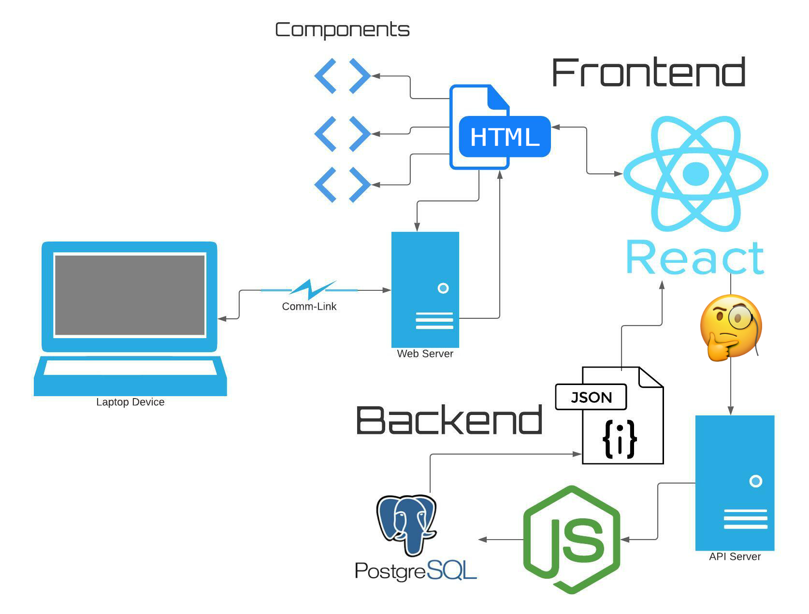

# Week 5 - Day 1 Intro to React

## Hour 1

Show'n'Tell'n'Debug

## Hours 2-3

REACT!

**Read this first!** -> * [Create-React-App Evolution (Bitsrc.io)](https://blog.bitsrc.io/the-future-of-react-why-create-react-app-is-deprecated-and-hooks-are-the-future-83e8a087a325)

**NOTE** React has changed quite a bit recently, i.e. a fairly drastic change in the last year.

Time permitting: We'll setup [Node](https://nodejs.org/en/about) using [Node Version Manager (NVM)](https://github.com/nvm-sh/nvm#installing-and-updating)

(If you have `brew` installed, this is another way to try to install `nvm` [NVM](https://collabnix.com/how-to-install-and-configure-nvm-on-mac-os/))

## Application Architecture

We're moving from simple DOM manipulation and `fetch()` requests into _more complex_ DOM manipulation and `fetch()` requests. 😉

Notably, we're moving in the realm of "Single Page Applications" aka "SPA."

## Presentations

* [Intro to React](https://docs.google.com/presentation/d/1v0moMo6PUqGvogbsfelnbTL0y-sIv7WbyRoIgY0Vly4/edit?usp=sharing)

## Guides

* [Official React "Get Started" Documentation](https://react.dev/learn)
* [React 2020 Cheatsheet (pdf file)](./files/React_2020_Cheatsheet_small.pdf)
* [SheCodes: React 2023 Cheat Sheet](http://cheatsheets.shecodes.io/react)
  This is more recent, but it's good to see the changes over the last few years.

## Resources

* [JavaScript Inheritance vs Composition](https://ui.dev/javascript-inheritance-vs-composition/)
* [Vite docs](https://vitejs.dev/)

## Keywords

* state
* props
* composition
* components
* single-page-application (SPA)
