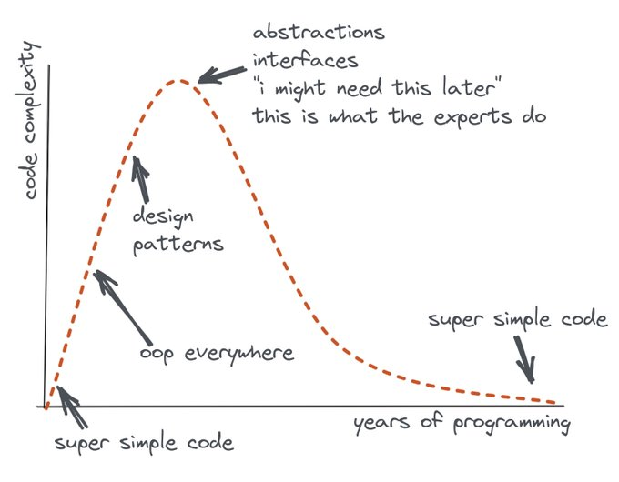

<!-- markdownlint-disable no-trailing-punctuation -->
# Resources

## Bookmark this blog!

* [Overreacted (Dan Abramov Blog)](https://overreacted.io/)

## React

* [Learning React? Start Small.](https://daveceddia.com/learning-react-start-small/)
* [Mistakes Junior React Developers Make](https://medium.com/frontend-digest/mistakes-junior-react-developers-make-c546b1af187d)

## Javascript

* [The Question of "Why?" in Single-Page-Application Frameworks](https://blog.logrocket.com/the-question-of-why-in-single-page-application-frameworks-91383446d0f5/)
* [JavaScript Inheritance vs Composition](https://ui.dev/javascript-inheritance-vs-composition/)

## Writing Code

> I always hated complexity, to be honest, but the more I go on, the more I hate it. And I especially dislike complexity in code that has no real need or utility other than sounding more "professional" or "pro". I've had tons of opportunities to appreciate simplicity and avoid complexity, and hating it when it was introduced into a codebase I didn't 100% control.

-- From [Flavio Copes Twitter Feed](https://twitter.com/flaviocopes/status/1417007331930423298)

---

> Coding is a journey. Think how far you came from your first line of code to where you are now. I reckon it was a joy to see for the first time how extracting a function or refactoring a class can make convoluted code simple. If you find pride in your craft, it is tempting to pursue cleanliness in code. Do it for a while.
>
> But don’t stop there. Don’t be a clean code zealot. Clean code is not a goal. It’s an attempt to make some sense out of the immense complexity of systems we’re dealing with. It’s a defense mechanism when you’re not yet sure how a change would affect the codebase but you need guidance in a sea of unknowns.
>
> Let clean code guide you. __Then let it go.__

-- From the post: [Goodbye Clean Code](https://overreacted.io/goodbye-clean-code/)