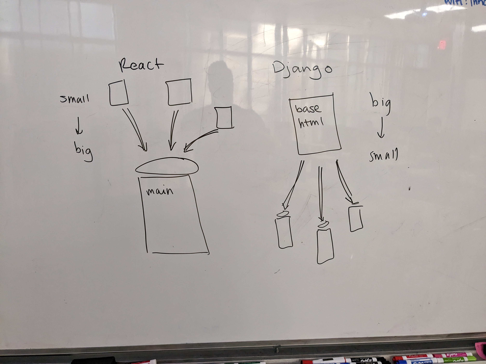

# Week 8 - Day 5

## Journal

Hey, remember that journal we started on even numbered weeks that I _totally_ forgot about on Week 6??

Let's bring that back to life and something in for Week 8! Reflect on where you are today, compared to where you were when you started. Brag on yourself, you've earned!

## JWT

Here ares some additional resources if you want to read up more on JWT and user authentication...

* [Djangon Rest Doc: Authentication](https://www.django-rest-framework.org/api-guide/authentication/)
* [SimpleJWT Docs: Getting Started](https://django-rest-framework-simplejwt.readthedocs.io/en/latest/getting_started.html)
* [How to Implement Tokenization using JWT and Django Rest Framework](https://www.freecodecamp.org/news/how-to-use-jwt-and-django-rest-framework-to-get-tokens/)
* [How to Use JWT Authentication with Django REST Framework](https://simpleisbetterthancomplex.com/tutorial/2018/12/19/how-to-use-jwt-authentication-with-django-rest-framework.html)

## Val's Tutorial Corner

Here's the sketch Val did to illustrate the diffence between React's SPA Client Side templates vs Django's Server-Side templates.

