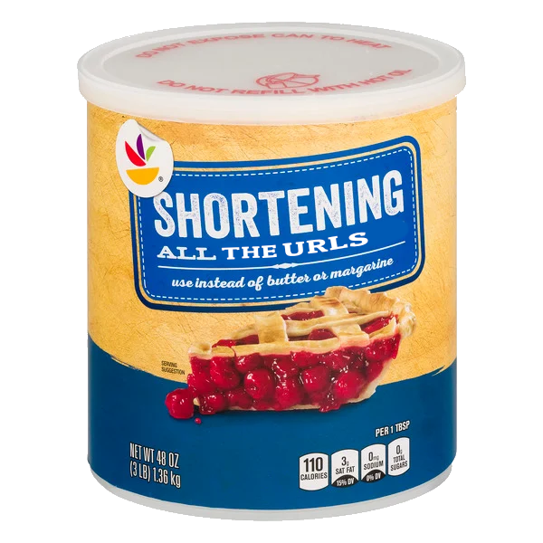

# Week 9 - Day 3

> "I hope you're proud of yourself for the times you've said 'yes,' when all it meant was extra work for you and was seemingly helpful only to someone else." — Fred Rogers.

## Today's Goals

We're going to keep working on the CRUDCo URL Shortening App.

OH, BTW, [here are the details for the final project!](../../final-project/README.md)

### Review

* Code Review
  * What worked?
  * Where are you stuck?
* Check our Models
  * Review [Django REST Framework: PrimaryKeyRelatedField](https://www.django-rest-framework.org/api-guide/relations/#primarykeyrelatedfield)
  * Verify migrations
* Test our API to add/update URLs via POSTMan
* Add in JWT and Authentication
* Protect `POST` requests
* Protect `GET` requests as well? Or allow "read only?"
  * Review [Django REST Framework: Permissions](https://www.django-rest-framework.org/api-guide/permissions/)
* Let's add some user and data!
* Prepare for some design work on the frontend

### New Features

* Build forms to login
* Build forms to submit a new URL
* Handle the _actual_ redirection!

## Helpful Links

* [Real Python: Django Redirects: A Super Simple Example](https://realpython.com/django-redirects/#django-redirects-a-super-simple-example)
* [Django ORM Cookbook](https://books.agiliq.com/projects/django-orm-cookbook/en/latest/index.html)
* [Vite ENV and Modes](https://vitejs.dev/guide/env-and-mode.html)
